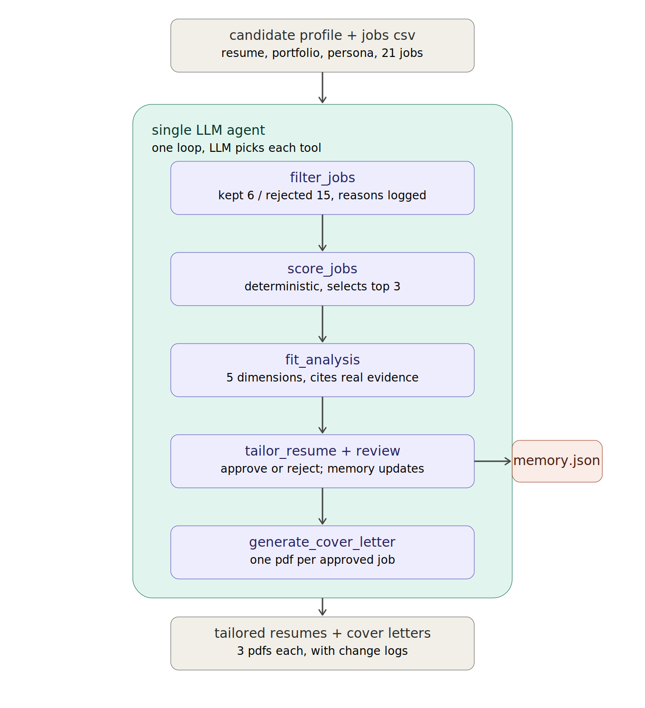

# Job Search Agent

This is a single-LLM job-search agent for our class assignment. It reads a candidate profile plus `ai_ml_jobs.csv`, filters and scores postings (scoring is deterministic Python, not the LLM), runs a fit analysis on the top 3, tailors a LaTeX resume for each, pauses once per resume for human review (with a `memory.json` that carries facts to later ranks), then writes cover letters. One agent loop picks the tools in order — not a multi-agent setup.



## Setup

You need:

- Python 3.10+ (this repo was run with a local `.venv`)
- A LaTeX install with `pdflatex` on your PATH (e.g. MacTeX / TeX Live). Resume and cover-letter PDFs are compiled with it.
- An OpenAI API key (Anthropic works as a fallback if you set that instead)

```bash
cd jobSearchAgent
python3 -m venv .venv
source .venv/bin/activate
pip install -r requirements.txt
cp .env.example .env
# edit .env and set OPENAI_API_KEY=...
```

Optional Langfuse tracing (skip if you don't care about the dashboard):

```bash
# also in .env
LANGFUSE_PUBLIC_KEY=...
LANGFUSE_SECRET_KEY=...
LANGFUSE_HOST=https://cloud.langfuse.com
```

Never commit `.env`.

## Run

End-to-end on the real CSV (scripted human review: reject rank 1 with a LangChain fact, then approve):

```bash
source .venv/bin/activate
python run_agent_e2e.py
```

A fresh run writes under `tailored_resumes/_agent_loop_real/`. The checked-in `outputs/` folder is the hand-in snapshot for the same Top-3 jobs (job details, resume before/after, cover letter, fit analysis).

The notebook `agent_notebook_v2.ipynb` has the same pipeline pieces cell-by-cell if you want to step through them; the script above is the reliable full run.

## Results

Real Top 3 from our scored run (`tailored_resumes/_agent_loop_real/agent_trace.json`):

| Rank | Job | Score |
|------|-----|------:|
| 1 | Fervo Energy — Agentic AI Engineer | 0.4083 |
| 2 | Community Health Systems (CHS) — Oracle Enterprise Data Scientist | 0.3917 |
| 3 | Lone Star College — Adjunct Faculty, Artificial Intelligence | 0.3333 |

Public Langfuse trace link is in the report.
